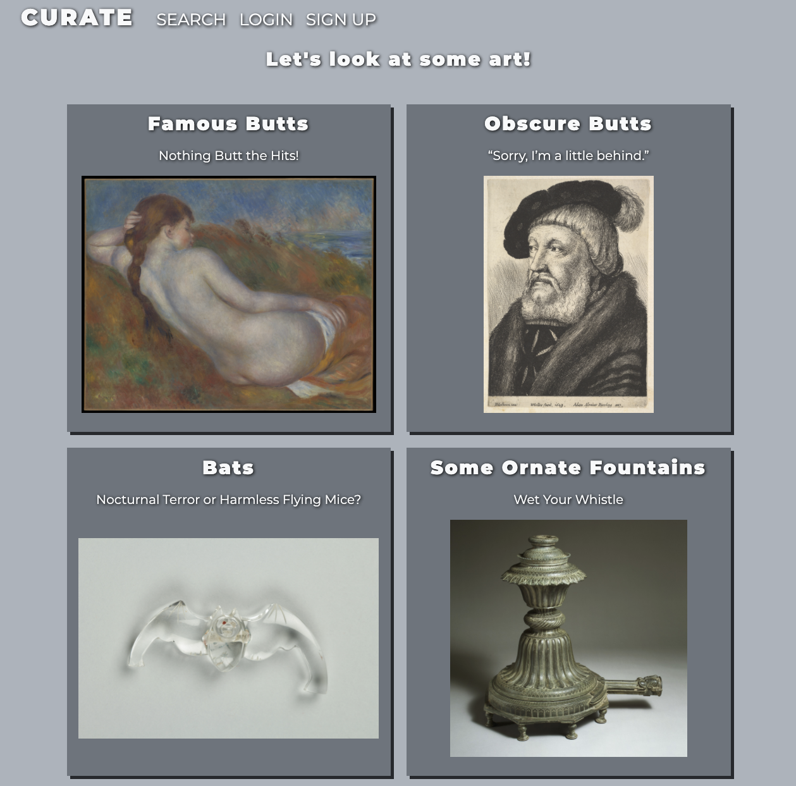

CURATE is an application that allows users to search the MET Museum's open archive and make their own exhibitions with over 500,000 pieces of art from across human history.

This is the final project for my software engineering bootcamp at Flatiron School.  February 2021.
It was built with a Rails backend, a React Frontend, and the MET Open Acress API.

